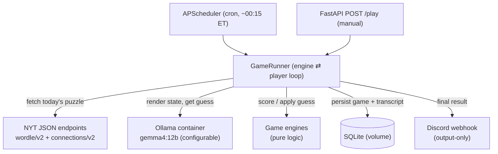

# Wordle & Connections LLM Bot — Design Specification

- **Status:** Approved design (pre-implementation)
- **Date:** 2026-06-17
- **Owner:** aworland
- **Project root:** `~/projects/wordle-connections-bot`
- **Next step:** implementation plan (superpowers `writing-plans`)

---

## 1. Summary

A self-contained, Dockerized service that **autonomously plays the day's real NYT Wordle and
Connections puzzles using a local Ollama LLM** and posts the results to a Discord channel via an
output-only webhook.

The system fetches the genuine daily puzzles from NYT's (unofficial) JSON endpoints, models each
game faithfully in a local engine, presents the live game state to the LLM, accepts the LLM's
guesses, scores them exactly as the real game would, and loops until the model wins, loses, or hits
the turn cap. Every game (puzzle, transcript, outcome, and the model used) is persisted to SQLite so
model performance can be compared over time. The final result of each game is posted to Discord as
an emoji share-grid with the answer hidden behind a spoiler tag.

### 1.1 Goals

1. Play **today's actual** Wordle and Connections (separate games, separate data sources).
2. Run the **LLM locally via Ollama**, with the model name fully configurable (default `gemma4:12b`).
3. Run **entirely in Docker** (backend **and** Ollama) for cross-platform deployment.
4. Faithfully model both games server-side; the LLM only sees game state and submits guesses.
5. Auto-play **daily on a schedule** and support **on-demand manual triggering**.
6. Persist results to **SQLite**, tagged by model, to enable per-model win-rate comparison.
7. Post a **final-result message** per game to Discord (emoji grid + spoiler-tagged answer).

### 1.2 Non-goals (out of scope for v1)

- No interactive Discord commands (webhook is **output-only** — it cannot receive input).
- No human play / multiplayer / leaderboards beyond the model-comparison stats.
- No web UI/dashboard (stats are queryable from SQLite; a dashboard is a possible future add).
- No attempt to mirror NYT's *current* curated Wordle answer list for puzzle generation — we always
  fetch the **live** solution from NYT, so a local answer list is unnecessary (a local **allowed-guess**
  list is still required, see §8.1).
- No multimodal/vision use of gemma4 (text-only interaction).

---

## 2. Locked decisions

| Area | Decision |
|------|----------|
| Discord integration | **Output-only webhook** — scheduled auto-play, posts results; no inbound traffic. |
| LLM host | **Ollama as a Docker service.** CPU on macOS; GPU via a compose override on Linux/NVIDIA. |
| Puzzle source | **Live NYT unofficial JSON** — separate endpoints for Wordle vs. Connections. |
| Backend language | **Python 3.12+.** |
| Discord output | **Final-result-only** message per game (emoji share-grid + outcome + stats). |
| Default model | **`gemma4:12b`**, fully env-configurable. |
| Persistence | **SQLite**, with per-model tagging for win-rate comparison. |
| Architecture | **A1** — single long-running container + internal APScheduler + tiny FastAPI (`/healthz`, `POST /play`). |
| Scheduling | **Daily auto (~00:15 America/New_York) + manual trigger.** Time configurable. |
| Invalid LLM guess | **Corrective re-prompt** (tell the model exactly why it was invalid, ask for a different valid word); **does not consume a game turn**. Generous configurable retry cap as an infinite-loop backstop only. |
| Answer reveal | **Spoiler-tagged** — always show the grid; hide the answer behind `\|\|spoiler\|\|`. |

---

## 3. Architecture

A single long-running Python container (`bot`) holds the scheduler, the game engines, the LLM
player, the persistence layer, and the Discord poster. It depends on a separate `ollama` container
for inference. There is **no inbound Discord traffic**; the only HTTP surface is a small internal
FastAPI app for health checks and manual triggering.



### 3.1 Rejected alternatives

- **A2 — pure cron job (container plays then exits):** simpler code, but no manual trigger, harder to
  observe, and clumsier to keep "all in Docker."
- **A3 — split engine-API + orchestrator services:** more moving parts than a single-user daily batch
  needs (YAGNI).

---

## 4. Container topology

### 4.1 Services (`docker-compose.yml`)

**`ollama`**
- Image: `ollama/ollama`.
- Named volume for model weights (so models survive restarts): `ollama_models:/root/.ollama`.
- Exposes `11434` on the internal compose network (no host port required unless desired for debugging).
- Healthcheck: probe `GET /api/tags` (HTTP 200 ⇒ ready).
- Model provisioning: an init step (entrypoint wrapper or the `bot`'s startup) ensures `$OLLAMA_MODEL`
  is present via `ollama.pull(...)` if `ollama.list()` does not contain it.

**`bot`** (our application)
- Built from the project `Dockerfile` (Python 3.12-slim base).
- `depends_on: { ollama: { condition: service_healthy } }`.
- Reaches Ollama at `http://ollama:11434` (compose service DNS) — **not** `localhost`.
- Mounts a named volume for the SQLite DB: `bot_data:/data`.
- Config entirely via environment (see §6). Webhook URL injected as a secret/env, never baked into the image.
- Runs the FastAPI app (uvicorn) which also boots the APScheduler on startup.

### 4.2 Cross-platform / GPU

- **Base `docker-compose.yml`** runs Ollama CPU-only — correct for macOS (Docker Desktop on macOS
  cannot pass through the Apple GPU/Metal; everything is CPU).
- **`docker-compose.gpu.yml`** override adds NVIDIA GPU reservations to the `ollama` service:
  ```yaml
  services:
    ollama:
      deploy:
        resources:
          reservations:
            devices:
              - driver: nvidia
                count: all
                capabilities: [gpu]
  ```
- Usage:
  - macOS (CPU): `docker compose up -d`
  - Linux + NVIDIA (GPU): `docker compose -f docker-compose.yml -f docker-compose.gpu.yml up -d`
    (host needs the NVIDIA Container Toolkit).

> **Performance note.** `gemma4:12b` (Q4_K_M, 7.6 GB) runs **CPU-only ≈ 5–12 tok/s** on an Apple
> M4 Pro inside Docker. Because this is a **non-interactive daily batch job** (a handful of turns,
> once a day), that is acceptable. For snappier local runs, set `OLLAMA_MODEL` to a smaller tier
> (`gemma4:e4b`, `gemma4:e2b`, `gemma3:4b`); on a GPU host use a larger tier (`gemma4:31b`, `gemma4:26b`).

---

## 5. Module layout

Each unit has one clear purpose, communicates through typed interfaces, and is independently testable.
Engines are **pure** (no network, no clock, no randomness except an injectable shuffle) so they can be
exhaustively unit-tested.

```
wordle-connections-bot/
├── docker-compose.yml
├── docker-compose.gpu.yml
├── Dockerfile
├── pyproject.toml                 # deps + tooling (ruff, mypy, pytest)
├── .env.example                   # documents every env var (no secrets)
├── README.md
├── app/
│   ├── config.py                  # pydantic-settings; loads/validates env; secrets never logged
│   ├── puzzles/                   # NYT data sources (I/O)
│   │   ├── dates.py               # "today" in America/New_York; date↔URL helpers
│   │   ├── wordle_source.py       # fetch + parse wordle/v2/{date}.json → WordlePuzzle
│   │   └── connections_source.py  # fetch + parse connections/v2/{date}.json → ConnectionsPuzzle
│   ├── engines/                   # PURE game logic (no I/O)
│   │   ├── models.py              # WordlePuzzle, ConnectionsPuzzle, GuessResult, GameState, enums
│   │   ├── wordle_engine.py       # two-pass scoring, validity, win/loss, state machine
│   │   └── connections_engine.py  # overlap eval, one-away, mistakes, group lock, share grid
│   ├── players/
│   │   ├── llm_player.py          # Ollama client wrapper; per-game schemas; corrective retry loop
│   │   └── prompts/               # Jinja or plain-string prompt templates (wordle, connections)
│   ├── wordlists/
│   │   └── allowed_guesses.txt    # ~12,972 valid 5-letter words for Wordle guess validation
│   ├── runner/
│   │   ├── game_runner.py         # orchestrates engine ⇄ player loop for one game
│   │   ├── scheduler.py           # APScheduler setup, cron trigger, idempotency guard
│   │   └── app.py                 # FastAPI: GET /healthz, POST /play
│   ├── output/
│   │   └── discord_webhook.py     # embed builder, grid renderer, spoilers, 429 backoff
│   └── storage/
│       ├── db.py                  # SQLite connection, schema/migrations, repositories
│       └── stats.py               # win-rate / distribution queries (views)
└── tests/
    ├── fixtures/                  # captured real NYT JSON (wordle + connections)
    ├── test_wordle_engine.py
    ├── test_connections_engine.py
    ├── test_sources.py            # parse fixtures, defensive schema handling
    ├── test_llm_player.py         # fake Ollama client (invalid-then-valid)
    ├── test_discord_webhook.py    # mock HTTP; assert limits/spoilers/muted mentions
    └── test_game_runner.py        # end-to-end with fakes
```

---

## 6. Configuration

All configuration is environment-driven via `pydantic-settings`. `.env` is git-ignored;
`.env.example` documents every variable.

| Env var | Default | Purpose |
|---------|---------|---------|
| `DISCORD_WEBHOOK_URL` | *(required, secret)* | Discord webhook URL (`/api/webhooks/{id}/{token}`). Never logged. |
| `OLLAMA_HOST` | `http://ollama:11434` | Ollama base URL (compose service DNS, **not** localhost). |
| `OLLAMA_MODEL` | `gemma4:12b` | Model tag. CPU fallbacks: `gemma4:e4b`, `gemma3:4b`. GPU: `gemma4:31b`. |
| `OLLAMA_NUM_CTX` | `8192` | Context window for the model call; must hold prompt + state + schema. |
| `OLLAMA_TEMPERATURE` | `0` | Sampling temperature (0 ⇒ most deterministic). |
| `OLLAMA_SEED` | `42` | Fixed seed for near-reproducible runs. |
| `OLLAMA_NUM_PREDICT` | `768` | Max tokens generated per turn (caps reasoning length). |
| `OLLAMA_AUTO_PULL` | `true` | Pull `OLLAMA_MODEL` at startup if missing. |
| `GAME_TYPES` | `wordle,connections` | Which games to play each cycle. |
| `SCHEDULE_CRON` | `15 0 * * *` | Daily run time (cron, in `SCHEDULE_TZ`). |
| `SCHEDULE_TZ` | `America/New_York` | Timezone for the schedule and "today" computation. |
| `MANUAL_TRIGGER_ENABLED` | `true` | Enable `POST /play`. |
| `MAX_INVALID_RETRIES` | `10` | Corrective re-prompt cap (backstop against infinite loops). |
| `WORDLE_HARD_MODE` | `false` | Enforce hard-mode constraints on the model's guesses. |
| `NYT_USER_AGENT` | `Mozilla/5.0 (...)` | Browser UA sent to NYT (helps with Connections' DataDome shield). |
| `NYT_TIMEOUT_SECONDS` | `10` | NYT request timeout. |
| `NYT_MAX_RETRIES` | `3` | NYT fetch retry count (with backoff). |
| `POST_ON_FETCH_FAILURE` | `false` | If true, post a "couldn't fetch today's puzzle" notice. |
| `DB_PATH` | `/data/games.db` | SQLite file path (on the mounted volume). |
| `LOG_LEVEL` | `INFO` | Logging verbosity. |

---

## 7. Data sources (NYT) — verified live 2026-06-17

> Both endpoints are **undocumented/unofficial**, require **no auth**, and are keyed by an explicit
> date in the URL. Treat them as fragile (see §18). Compute "today" in `SCHEDULE_TZ`
> (`America/New_York`) so the date aligns with NYT's canonical rollover.

### 7.1 Wordle — `wordle_source.py`

- **Endpoint:** `GET https://www.nytimes.com/svc/wordle/v2/{YYYY-MM-DD}.json`
- **Verified response (2026-06-17):**
  ```json
  {"id":1735,"solution":"token","print_date":"2026-06-17","days_since_launch":1824,"editor":"Tracy Bennett"}
  ```
- **Fields:** `id` (int), `solution` (lowercase 5-letter string — **always present on 200**),
  `print_date` (str), `days_since_launch` (int), `editor` (str).
- **Defensive parsing:** very old dates omit `days_since_launch` and/or `editor` — read them with
  `.get(...)`. Only `solution` and `print_date` are guaranteed.
- **Puzzle number for display:** use `days_since_launch` (matches NYT's displayed number for current
  puzzles), falling back to `id` if absent.
- **Errors:** out-of-range/unpublished dates return **HTTP 404** with
  `{"status":"ERROR","errors":["Not Found"],"results":[]}`.
- **Headers/auth:** none required; UA optional. (We still send `NYT_USER_AGENT` for consistency.)
- **Parsed type:** `WordlePuzzle(date, number, solution, editor)`.

### 7.2 Connections — `connections_source.py`

- **Endpoint:** `GET https://www.nytimes.com/svc/connections/v2/{YYYY-MM-DD}.json`
- **Verified response (2026-06-17, abridged):**
  ```json
  {"status":"OK","id":1177,"print_date":"2026-06-17","editor":"Wyna Liu","categories":[
    {"title":"ALCOVE","cards":[{"content":"CAVITY","position":1},{"content":"NICHE","position":15},
      {"content":"NOOK","position":8},{"content":"RECESS","position":13}]},
    {"title":"BODILY WORDS FOR ATTITUDE","cards":[...]},
    {"title":"FIGURES IN GREEK MYTH","cards":[...]},
    {"title":"STARTING WITH SYNONYMS FOR \"ILK\"","cards":[...]}]}
  ```
- **Fields:** `status`, `id` (int — **not** date-sequential; never derive date from it), `print_date`,
  `editor`, `categories` (exactly 4). Each category: `title` (str), `cards` (exactly 4), each card:
  `content` (UPPERCASE word/phrase), `position` (0–15 grid slot).
- **CRITICAL — no difficulty field.** v2 carries **no `level`/`color`/`difficulty`**. Difficulty is
  **derived from category array order**: `categories[0]`→YELLOW (easiest) … `categories[3]`→PURPLE
  (hardest). This is NYT's ordering convention and is the spec's single source-coupled assumption
  (see §18 risk).
- **Invariants asserted on parse:** `len(categories) == 4`; each has exactly 4 cards; the union of all
  16 `position` values equals `{0..15}`. Fail loudly if violated.
- **DataDome:** responses set a `datadome` cookie; sending a browser UA reduces the chance of a bot
  challenge. The v1 endpoint was removed (2025-09-20) — **v2 only**.
- **Errors:** unpublished dates → **HTTP 404** (same error shape as Wordle).
- **Parsed type:** `ConnectionsPuzzle(date, number, editor, groups)` where each `Group(title, words[4],
  level)` and `level = enumerate index` (0–3). The 16 words are shuffled for presentation (board
  `position` is captured but the engine re-shuffles via an injectable RNG for testability).

### 7.3 Date logic — `dates.py`

```python
from datetime import datetime
from zoneinfo import ZoneInfo

def today_str(tz: str) -> str:
    return datetime.now(ZoneInfo(tz)).strftime("%Y-%m-%d")
```

---

## 8. Game engines (pure logic)

### 8.1 Wordle engine — `wordle_engine.py`

**Rules:** 5-letter word, 6 guesses, win on all-green.

**Scoring — canonical two-pass multiset** (the load-bearing correctness detail):

```python
from collections import Counter
from enum import Enum

class Mark(str, Enum):
    GREEN = "green"; YELLOW = "yellow"; GRAY = "gray"

def score_guess(guess: str, solution: str) -> list[Mark]:
    # both lowercase, length 5, pre-validated
    n = len(solution)
    result = [Mark.GRAY] * n
    remaining = Counter(solution)
    # PASS 1: greens consume from the multiset FIRST
    for i in range(n):
        if guess[i] == solution[i]:
            result[i] = Mark.GREEN
            remaining[guess[i]] -= 1
    # PASS 2: yellows only if a count remains; else stay gray
    for i in range(n):
        if result[i] is Mark.GREEN:
            continue
        if remaining[guess[i]] > 0:
            result[i] = Mark.YELLOW
            remaining[guess[i]] -= 1
    return result
```

**Why two passes (test fixtures):**
- `guess="ALLEY", solution="LEAFY"` → `[YELLOW, YELLOW, GRAY, YELLOW, GREEN]` — the **second `L` is gray**
  because the solution has only one `L` (consumed by the first). A naive `'yellow if ch in solution'`
  scorer wrongly marks both yellow. **This is the canonical bug the engine must not have.**
- `guess="EERIE", solution="ELDER"` → `[GREEN, YELLOW, YELLOW, GRAY, GRAY]` — the third `E` is gray
  (only 2 `E`s exist; used by green + first yellow).
- `guess="SPEED", solution="ERASE"` → `[YELLOW, GRAY, YELLOW, YELLOW, GRAY]`.

**Guess validity:** lowercased, stripped; exactly 5 a–z letters; member of the bundled
`allowed_guesses.txt` (~12,972 words); not already guessed this game. The **solution comes from NYT**,
so no answer list is needed for play — the allowed list is purely for validating the model's guesses.
The allowed-guesses list is sourced once at build time from public mirrors
(`dracos/valid-wordle-words.txt` ≈ 12,972 entries) and committed to `app/wordlists/`.

**Hard mode (optional, `WORDLE_HARD_MODE`):** revealed greens must stay in place and revealed yellows
must reappear, accumulated across **all** prior guesses (track the strongest per-position/per-letter
constraint). Violations are treated like an invalid guess (corrective re-prompt; no turn consumed).

**State:** `WordleState(solution, guesses=[], feedback=[], attempts_used, status ∈ {IN_PROGRESS, WON, LOST})`.
Win when feedback is all-green; lose after 6 valid guesses without a win.

### 8.2 Connections engine — `connections_engine.py`

**Rules:** 16 words, 4 hidden groups of 4, 4 mistakes allowed.

**Difficulty / color** (derived from category order, see §7.2):

```python
from enum import IntEnum
class Level(IntEnum): YELLOW=0; GREEN=1; BLUE=2; PURPLE=3
EMOJI = {Level.YELLOW:"🟨", Level.GREEN:"🟩", Level.BLUE:"🟦", Level.PURPLE:"🟪"}
```

**Submit a guess (exactly 4 words):**

```python
def submit(self, selection: frozenset[str]) -> SubmitResult:
    assert len(selection) == 4 and selection <= self.remaining_words
    if selection in self.past_guesses:
        return SubmitResult.ALREADY_GUESSED        # no mistake, not recorded
    self.past_guesses.add(selection)
    best = max(len(selection & g.word_set) for g in self.unsolved_groups)
    self.guess_rows.append(selection)              # for share grid (true colors)
    if best == 4:
        self._lock_matching_group(selection)
        return SubmitResult.WIN if self.all_solved else SubmitResult.CORRECT
    self.mistakes += 1
    if self.mistakes >= 4:
        return SubmitResult.LOSS                    # remaining groups revealed
    return SubmitResult.ONE_AWAY if best == 3 else SubmitResult.INCORRECT
```

- **"One away"** fires iff a single real group is matched by **exactly 3** of the 4 selected words; it
  is informational but **still costs a mistake**.
- **Duplicate-guess guard:** resubmitting an already-tried set is rejected with **no mistake** and is
  not added to the share grid.
- **Win:** all 4 groups solved (regardless of mistakes 0–3). **Loss:** 4th incorrect guess.
- **Share grid:** one row per recorded guess (chronological); each row = 4 squares colored by each
  word's **true** group color (so wrong rows are multi-colored). Built from `word → EMOJI[level]`.

---

## 9. LLM player & game contract

### 9.1 Ollama client

```python
from ollama import Client
client = Client(host=settings.ollama_host)   # e.g. http://ollama:11434
```

Each turn calls `client.chat(model, messages, format=<schema>, options={...})` with
`options = {"temperature": 0, "seed": 42, "num_ctx": 8192, "num_predict": 768}`.

### 9.2 Structured-output schemas (Pydantic → `format=`)

```python
class WordleTurn(BaseModel):
    reasoning: str            # brief chain-of-thought / justification (stored, not posted verbatim)
    guess: str                # validated in Python: 5 a-z letters, in dict, not repeated

class ConnectionsTurn(BaseModel):
    reasoning: str
    group: list[str]          # exactly 4 words from the remaining pool
    category_guess: str       # the model's hypothesis label (stored; not scored)
```

`format = WordleTurn.model_json_schema()`. **Do not** use JSON-schema `pattern`/regex constraints —
Ollama currently 500s on them; enforce letter/length/membership in Python instead.

### 9.3 Prompt construction (`players/prompts/`)

Each prompt contains: the rules, the **current game state rendered as text**, and the **JSON schema
embedded inline** (Ollama grounding recommendation). Examples of rendered state:
- **Wordle:** each prior guess as `WORD → 🟩🟨⬜⬜🟩` plus a per-letter legend, attempts remaining,
  and (if hard mode) the active constraints.
- **Connections:** remaining words (shuffled), solved groups (title + words), mistakes remaining, and
  the list of already-tried 4-word sets to avoid repeats.

### 9.4 Output validation & the corrective re-prompt loop

`format=` does **not** guarantee schema-valid JSON, and a valid object can still be an **illegal game
move**. The player therefore runs a bounded loop:

```python
for attempt in range(settings.max_invalid_retries):
    raw = client.chat(model, messages, format=schema, options=opts).message.content
    try:
        turn = schema_model.model_validate_json(raw)   # JSON + type check
    except (ValidationError, json.JSONDecodeError) as e:
        messages += [{"role":"assistant","content":raw},
                     {"role":"user","content":f"Your reply was not valid JSON for the schema: {e}. "
                                              "Reply ONLY with JSON matching the schema."}]
        continue
    problem = engine.validate_move(turn)   # game-legality check
    if problem is None:
        return turn                         # legal move — apply it (consumes a turn)
    # Legal-JSON but illegal move: tell the model EXACTLY why, ask for a different valid word/set.
    messages += [{"role":"assistant","content":raw},
                 {"role":"user","content":problem.feedback}]   # e.g. "ALLEYY is not a valid 5-letter
                                                              # word. It must be a real 5-letter word
                                                              # in the dictionary. Pick a different word."
raise InvalidMoveExhausted()   # backstop only → game outcome = ERRORED
```

- **Invalid guesses never consume a game turn** (faithful to the real games, which block bad input).
- The corrective message is **specific**: not-5-letters / not-in-dictionary / already-guessed
  (Wordle); wrong-size / word-not-in-pool / set-already-tried (Connections).
- `MAX_INVALID_RETRIES` (default 10) is an **infinite-loop backstop**, not a gameplay penalty. On
  exhaustion the game is recorded with outcome `ERRORED` (distinct from `LOSS`); a notice may be posted
  if `POST_ON_FETCH_FAILURE`-style behavior is desired (config). This should be rare.

---

## 10. Game runner

`game_runner.py` orchestrates one game end-to-end and is engine-agnostic via a small protocol:

```
fetch puzzle → build engine + initial state
loop while IN_PROGRESS and turns remain:
    render state → llm_player.take_turn() (with corrective retries)
    apply legal move to engine → record TurnRecord(guess, feedback, reasoning, retries)
persist GameRecord (+ turns) to SQLite
render final share message → discord_webhook.post()
```

The runner is invoked per `(game_type)` by both the scheduler and the manual endpoint.

---

## 11. Persistence (SQLite)

`DB_PATH=/data/games.db` on a mounted volume. Schema:

```sql
CREATE TABLE IF NOT EXISTS games (
    id            INTEGER PRIMARY KEY AUTOINCREMENT,
    game_type     TEXT    NOT NULL,         -- 'wordle' | 'connections'
    puzzle_date   TEXT    NOT NULL,         -- 'YYYY-MM-DD'
    puzzle_number INTEGER,                  -- displayed number (days_since_launch / connections id)
    puzzle_id     INTEGER,                  -- raw NYT id
    model         TEXT    NOT NULL,         -- e.g. 'gemma4:12b'
    started_at    TEXT    NOT NULL,         -- ISO8601
    finished_at   TEXT,
    outcome       TEXT    NOT NULL,         -- 'win' | 'loss' | 'errored'
    num_guesses   INTEGER NOT NULL,         -- valid guesses applied
    num_mistakes  INTEGER NOT NULL,         -- Connections: incorrect guesses (0-4). Wordle: non-winning valid guesses (= num_guesses-1 on win, num_guesses on loss)
    answer_json   TEXT    NOT NULL,         -- solution word / groups (titles+words)
    UNIQUE (game_type, puzzle_date, model)  -- dedupe daily runs; compare models on same puzzle
);

CREATE TABLE IF NOT EXISTS turns (
    id           INTEGER PRIMARY KEY AUTOINCREMENT,
    game_id      INTEGER NOT NULL REFERENCES games(id) ON DELETE CASCADE,
    turn_index   INTEGER NOT NULL,
    guess_json   TEXT    NOT NULL,          -- the word / the 4-word set
    feedback_json TEXT   NOT NULL,          -- per-letter marks / submit result
    reasoning    TEXT,                      -- model's stated reasoning
    was_valid    INTEGER NOT NULL,          -- 1 (legal move) — invalid attempts are not stored as turns
    retries      INTEGER NOT NULL DEFAULT 0 -- corrective re-prompts spent before a legal move
);
```

The `UNIQUE(game_type, puzzle_date, model)` constraint is the **idempotency key**: a re-run for the
same day+model is a no-op (no double-post). Switching `OLLAMA_MODEL` lets a different model play the
same puzzle for comparison.

**Stats (`stats.py`)** — queries/views for: win-rate per model, win-rate per `(model, game_type)`,
Wordle guess distribution, average guesses, average mistakes.

---

## 12. Discord output (`discord_webhook.py`)

- **Endpoint:** `POST $DISCORD_WEBHOOK_URL` (`/api/webhooks/{id}/{token}`), `Content-Type: application/json`,
  no auth header. Default `204 No Content`; we don't need the message id.
- **Body:** one `embed`. Grid lives in `embed.description` (limit 4096 — far more than enough).
- **`color`** is a **decimal int** (e.g. Wordle green `#57F287` → `5763719`), chosen by outcome.
- **`allowed_mentions: {"parse": []}`** to suppress accidental pings.
- **Spoilers:** wrap the answer in `\|\|...\|\|`. **Not inside code blocks** (spoilers don't work there),
  so the grid is plain (emoji render fine without monospacing).
- **Rate limits:** on `429`, sleep `Retry-After` and retry (simple bounded backoff). Effectively never
  hit at this volume.
- **Emoji:** Wordle `🟩`/`🟨`/`⬜`; Connections `🟨`/`🟩`/`🟦`/`🟪`. Files are UTF-8.

**Wordle final embed (example):**
```
title:       "Wordle 1,824  4/6"          # "X/6" on loss
description: "🟨⬜⬜⬜⬜\n🟨🟨⬜⬜⬜\n🟩🟩⬜🟨⬜\n🟩🟩🟩🟩🟩\n\n||Answer: TOKEN — guessed by gemma4:12b||"
color:       5763719                       # green win / red loss
footer:      "model: gemma4:12b · auto-played"
```

**Connections final embed (example):**
```
title:       "Connections 552  3/4"
description: "🟩🟩🟪🟩\n🟦🟦🟦🟦\n🟨🟨🟨🟨\n🟩🟩🟩🟩\n\n||ALCOVE: CAVITY, NICHE, NOOK, RECESS\n…||"
color:       by outcome
footer:      "model: gemma4:12b · mistakes: 1"
```

---

## 13. Scheduling (`scheduler.py`)

- **APScheduler** `CronTrigger` from `SCHEDULE_CRON` in `SCHEDULE_TZ` (default `15 0 * * *`
  America/New_York — ~15 min after NYT rollover to ensure the day's puzzles are published).
- On fire: for each `GAME_TYPES`, run the game **unless** a record already exists for
  `(game_type, today, model)` (idempotency).
- **Manual:** `POST /play?game=wordle|connections|both` runs immediately (same idempotency guard;
  `?force=true` deletes any existing record for that day+model and replays it, for re-runs/testing).
- Scheduler starts on FastAPI startup; `GET /healthz` reports liveness + Ollama reachability + next run.

---

## 14. Error handling & resilience

| Failure | Handling |
|---------|----------|
| NYT timeout / 5xx / DataDome challenge | Retry `NYT_MAX_RETRIES` with exponential backoff + browser UA. |
| NYT 404 (puzzle not yet published) | Log + skip that game this cycle; idempotency lets a later run pick it up. |
| NYT schema drift (missing keys, bad invariants) | Parse defensively (`.get`); assert Connections invariants; on hard failure, skip + log (optional notice). |
| Ollama model missing | Auto-pull at startup if `OLLAMA_AUTO_PULL`; else fail health check with a clear message. |
| Ollama invalid JSON / illegal move | Bounded corrective retries (§9.4); exhaustion ⇒ `ERRORED` outcome. |
| Ollama unreachable | Health check fails; cycle logs and aborts that game. |
| Discord 429 | Honor `Retry-After`, bounded backoff. |
| Discord 4xx (bad body/limits) | Log full response; do not crash the cycle. |
| Duplicate daily run | `UNIQUE(game_type, puzzle_date, model)` no-op. |

All errors are structured-logged; the daily cycle is fault-isolated per game (a Wordle failure doesn't
block Connections).

---

## 15. Security & secrets

- `DISCORD_WEBHOOK_URL` is a bearer-style secret (anyone with it can post) — injected via env/secret,
  **never** committed or logged. `.env` is git-ignored; `config.py` redacts it in any diagnostic output.
- No inbound network surface is exposed publicly (FastAPI bound to the internal network / localhost;
  `POST /play` is for operator/manual use, not the internet).
- NYT requests are read-only GETs of public endpoints.
- Container runs as a non-root user; minimal base image.

---

## 16. Testing strategy

- **Wordle engine:** unit tests for the two-pass scorer using the verified fixtures (`ALLEY/LEAFY`,
  `EERIE/ELDER`, `SPEED/ERASE`), validity (length/charset/dictionary/repeat), win/loss boundaries, and
  hard-mode constraint accumulation.
- **Connections engine:** overlap scoring, one-away (exactly-3) detection, mistake counting, group
  lock, duplicate-guess guard, win/loss, and share-grid color rendering.
- **Sources:** parse **captured real NYT JSON** in `tests/fixtures/` (today's `token`; the `ALCOVE/…`
  Connections set; an old Wordle record missing `editor`/`days_since_launch`; a 404 body). Assert types
  and invariants; assert level-by-order derivation for Connections.
- **LLM player:** a **fake Ollama client** returning canned responses, including invalid-JSON-then-valid
  and illegal-move-then-legal sequences, to prove the corrective loop never consumes a turn and the
  backstop fires correctly.
- **Discord poster:** mock HTTP; assert body shape, decimal color, spoiler placement (not in code
  block), muted mentions, and 429 backoff.
- **Game runner:** end-to-end with all fakes for both a win and a loss, asserting persisted records.
- **Tooling:** `pytest`, `ruff`, `mypy`. Engines are deterministic (injectable RNG for the Connections
  shuffle) so all engine tests are network-free and reproducible.

---

## 17. Observability

- Structured logging (`LOG_LEVEL`), with the webhook URL always redacted.
- Per-game transcript persisted (model reasoning + every turn) for later inspection / model comparison.
- `GET /healthz`: liveness, Ollama reachability, configured model, next scheduled run.
- Stats queries (§11) provide win-rate and distribution per model over time.

---

## 18. Legal / ToS note

The NYT endpoints are **undocumented and unofficial**; "Wordle"/"Connections" are NYT trademarks. This
project is **personal, non-commercial, and non-redistributive** (it does not republish NYT's puzzle
content at scale or imply affiliation). Risks accepted by the owner:
- Endpoints may change shape, add auth, or be removed without notice → the system degrades gracefully
  (skip + log) rather than crashing.
- Connections difficulty is inferred from **category array order** (no explicit field) — if NYT ever
  reorders, colors could misalign; this is the one source-coupled assumption and is isolated in
  `connections_source.py`.

---

## 19. Dependencies (Python)

- `ollama` (official client) · `pydantic` + `pydantic-settings` · `fastapi` + `uvicorn` ·
  `apscheduler` · `httpx` (NYT + Discord) · `tenacity` (backoff) — stdlib `sqlite3` for persistence.
- Dev: `pytest`, `respx`/`httpx` mock transport, `ruff`, `mypy`.

---

## 20. Acceptance criteria

1. `docker compose up -d` on macOS brings up `ollama` + `bot`; the model is pulled automatically; the
   bot reports healthy.
2. On schedule (or `POST /play`), the bot fetches **today's real** Wordle and Connections, plays each
   with the configured model, and posts a final emoji-grid message per game with the answer
   spoiler-tagged.
3. Wordle scoring matches the real game on all duplicate-letter fixtures; Connections enforces 4
   mistakes, one-away, and group locking.
4. Invalid model guesses produce a specific corrective re-prompt and **do not** consume a game turn.
5. Each game is persisted with its model tag; re-running the same day+model does not double-post;
   changing `OLLAMA_MODEL` lets another model play the same puzzle, and per-model win-rate is queryable.
6. On a Linux/NVIDIA host, adding `-f docker-compose.gpu.yml` runs Ollama on the GPU with no code change.

---

## 21. Future (explicitly deferred)

- Interactive Discord bot (Gateway/slash commands) for on-demand play by users.
- Stats dashboard / scheduled weekly summary post.
- Wordle hard-mode default on; strategy comparison across multiple models per day.
- Last-known-good puzzle cache for graceful degradation when NYT is unreachable.
